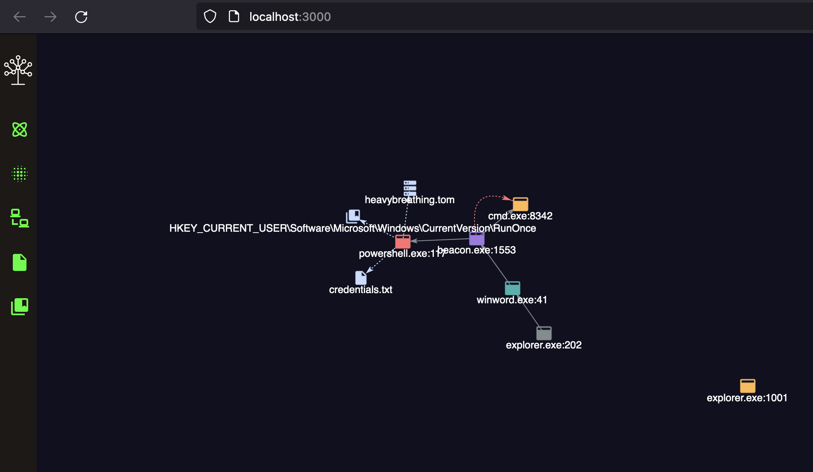

# Detectree

---

Detectree is a data visualisation tool for blue teams. It provides a graphical representation of detection data, which allows an analyst generate almost instant opinions about the nature of the underlying activity and to understand complex relationships between the data points. Ultimately, this can help reduce response time, reduce alert fatigue and facilitate communication between analysts within the teams.

Detectree is written in svelte and based on the [force-graph](https://github.com/vasturiano/force-graph) javascript library.

---

## Getting Started

In order to use Detectree in your environment the detections need to satisfy a minimum set of properties. In the following table you can see which fields must be included in each detection and which are optional.

| Field               | Required |
| ------------------- | -------- |
| Endpoint ID         | yes      |
| Category            | yes      |
| Severity            | yes      |
| Detection Name      | yes      |
| Parent Process Name | yes      |
| Parent Process ID   | yes      |
| Process Name        | yes      |
| Process ID          | yes      |
| User                | no       |
| Command Line        | no       |
| File Name           | no       |
| Registry Key        | no       |
| Network Address     | no       |
| Target Process Name | no       |
| Target Process ID   | no       |

The mappings for each field are defined in the _schema.yml_ file, an example file [schema.yml.example](./schema.yml.example) is provided. This file defines which fields should be extracted from the data in the backend and how they are mapped internally. In particular the mapping part contains the detectree mapping on the left and the backend mapping on the right, you will need to populate the mapping according to your environment.

The schema also contains the backend configuration, for elastic it should be straight forward but the meaning of the various fields is the following:

`primaryId` is the unique identifier for the endpoint. This is what is used to retireve the detections.
`timeField` is the time field used to restrict the query.
`source` is the field which identifies the detection type, in the example schema this is mapped to `NewProcess`, `RegistryWrite`, `FileAccess` and so on.

Subsequently in the `mappings` the `type` field identifies a specific detection, for example if your backend only supports `NewProcess` detections (or whatever the corresponding name is) you will require only one mapping. Strictly related to this the `kind` field links the detection type to the detectree one. As an example if `kind` is `file` the mapping should provide a `filePath` which will be used to draw a context node.

Currently the only supported backend is elastic however it should be trivial to build an adapter for any new backend. See the [Adding a new backend](#adding-a-new-backend) section for further information.

In order to deploy the application in your environment you need to install the required dependencies with with `npm install` (or `pnpm install` or `yarn`). You will then need to select the right adapter for your environment, follow [this guide](https://kit.svelte.dev/docs/adapters) for the most up to date information.

If for example you want to use node as your backend you need to install `@sveltejs/adapter-node` add modify your `svelte.config.js` substituting `@sveltejs/adapter-auto` with `@sveltejs/adapter-node`. The project can then be built with the following command, the output will be in the `output` folder.

```bash

npm run build

```

A development server can be started with, this will allow to serve the application locally.

```bash
npm run dev

# or start the server and open the app in a new browser tab
npm run dev -- --open
```

An example graph can be seen in the following screenshot



## Adding a new backend

In order to support a new backend you need to create a dedicated TypeScript file in the [backend_adapters](./src/backend_adapters/) folder. You can use the elastic one as a template, the new module should expose a query function that should take as input the same parameters as the one in the elastic file. You can then query the chosen backend in the preferred way. The query function should return an object containing the data mapped according to the mapping defined in the schema.yaml file. Finally in order for the backend to be correctly selected you also need to add it in the following object inside [draw_tree.ts](./src/routes/draw_tree.ts), the object keys here will also be how the backend is referenced in the `schema.yml`

```js
const backendTypes = {
	elastic: '../backend_adapters/elastic'
};
```
